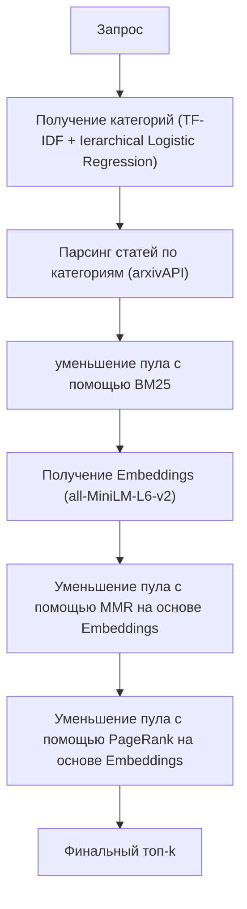

# Тема: «Разработка комплекса алгоритмов поиска и ранжирования научных публикаций по семантическим метаданным c сайта arxiv.org»

## Цель  
Разработать комплекс взаимосвязанных алгоритмов, обеспечивающий ранжирование научных публикаций на основе **семантических метаданных**, доступных через arxivAPI.

## Задачи  
 1. Реализовать предобработчик текста для семантических метаданных
 2. Реализовать алгоритм поиска статей и парсинг их метаданных при помощи arxivAPI для формирования начального пула
 3. Исследовать алгоритмы поиска релевантных документов
 4. Реализовать комплекс алгоритмов фильтрации научных публикаций на основе семантических метаданных

## Комплекс алгоритмов
 1. Формирование начального пула: TF-IDF, Ierarchical Logistic Regression
 2. Фильтрация по семантическим данным: BM25, all-MiniLM-L6-v2, MMR, PageRank, 

---

## Архитектура итоговой системы

## Список использованной литературы
  1. arxiv // arxiv.org URL: https://arxiv.org/ (дата обращения: 2.10.2025).
  2. Логистическая регрессия // GetSomeMath URL: http://getsomemath.ru/subtopic/machine_learning/linear_ml_models/logistic_regression (дата обращения: 15.09.2025).
  3. The Probabilistic Relevance Framework:BM25 and Beyond // ResearchGate URL: https://www.researchgate.net/publication/220613776_The_Probabilistic_Relevance_Framework_BM25_and_Beyond (дата обращения: 20.09.25).
  4. Scoring, term weighting and the vector space model // Introduction to Information Retrieval URL: https://nlp.stanford.edu/IR-book/html/htmledition/scoring-term-weighting-and-the-vector-space-model-1.html (дата обращения: 25.09.2025).
  5. Wenhui Wang. MiniLM: Deep Self-Attention Distillation for Task-Agnostic Compression of Pre-Trained Transformers / MiniLM: Deep Self-Attention Distillation for Task-Agnostic Compression of Pre-Trained Transformers [et.al] — Текст : электронный // arXiv. — 2020. — URL: https://arxiv.org/abs/2002.10957.
  6. Beyond Nearest Neighbors: Semantic Compression and Graph-Augmented Retrieval for Enhanced Vector Search / Rahul Raja [et.al] — Текст : электронный // arXiv. — 2025. — URL: https://arxiv.org/abs/2507.19715 (дата обращения: 23.09.2025).
  7. Arman Cohan. SPECTER: Document-level Representation Learning using Citation-informed Transformers / Arman Cohan [et.al] — Текст : электронный // arXiv. — 2020. — URL: https://arxiv.org/abs/1406.2661 (дата обращения: 28.09.2025)
  8. Bharvi Dixit Mastering Elasticsearch 5.x. - 3-е изд. - Packt Publishing, 2017. - 412 с.
  9. Carbonell, Jaime G. and Goldstein, Jade, "The Use of MMR and Diversity-Based Reranking in Document Reranking and
Summarization" (1998). Computer Science Department. Paper 342.
  10. Open-World Evaluation for Retrieving Diverse Perspectives / Hung-Ting Chen [et.al] — Текст : электронный // arXiv. — 2024. — URL: https://arxiv.org/html/2409.18110v2 (дата обращения: 1.10.2025).
  11. Брин, С.; Пейдж, Л. The Anatomy of a Large-Scale Hypertextual Web Search Engine [Текст] / С. Брин, Л. Пейдж // Computer Networks and ISDN Systems. — 1998. — Т. 30, № 1–7. — С. 107–117. — DOI: 10.1016/S0169-7552(98)00110-X.
  12. BERT as a reranking engine // Continuum Labs URL: https://training.continuumlabs.ai/disruption/search/bert-as-a-reranking-engine (дата обращения: 2.10.2025).

