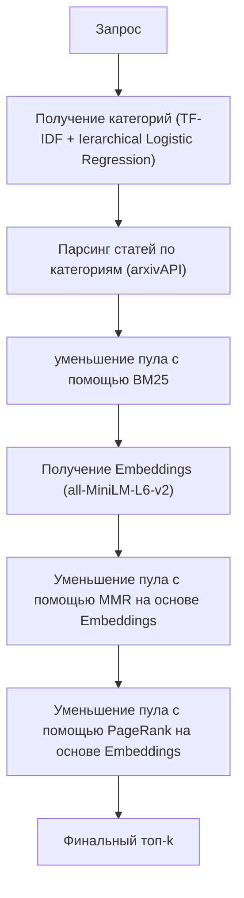

# Тема: «Разработка комплекса алгоритмов поиска и ранжирования научных публикаций по семантическим метаданным c сайта arxiv.org»

## Цель  
Разработать комплекс взаимосвязанных алгоритмов, обеспечивающий ранжирование научных публикаций на основе **семантических метаданных**, доступных через arxivAPI.

## Задачи  
 1. Реализовать предобработчик текста для семантических метаданных
 2. Реализовать алгоритм поиска статей и парсинг их метаданных при помощи arxivAPI для формирования начального пула
 3. Исследовать алгоритмы поиска релевантных документов
 4. Реализовать комплекс алгоритмов фильтрации научных публикаций на основе семантических метаданных

## Комплекс алгоритмов
 1. Формирование начального пула: TF-IDF, Ierarchical Logistic Regression
 2. Фильтрация по семантическим данным: BM25, all-MiniLM-L6-v2, MMR, PageRank, 

---

## Архитектура итоговой системы

## Список использованной литературы
  1. arXiv Dataset // Kaggle URL: https://www.kaggle.com/datasets/Cornell-University/arxiv (дата обращения: 30.09.2025).
  2. Логистическая регрессия // GetSomeMath URL: http://getsomemath.ru/subtopic/machine_learning/linear_ml_models/logistic_regression (дата обращения: 15.09.2025).
  3. Кристофер Д. Маннинг, Прабхакар Рагхаван, Хайнрих Шютце Введение в информационный поиск. - Санкт-Петербург: Вильямс, 2011. - 511 с.
  4. The Probabilistic Relevance Framework:BM25 and Beyond // ResearchGate URL: https://www.researchgate.net/publication/220613776_The_Probabilistic_Relevance_Framework_BM25_and_Beyond (дата обращения: 20.09.25).
  5. TF-IDF // Wikipedia URL: https://ru.wikipedia.org/wiki/TF-IDF (дата обращения: 19.09.25).
  6. all-MiniLM-L6-v2 // Hugging Face URL: https://huggingface.co/sentence-transformers/all-MiniLM-L6-v2 (дата обращения: 28.09.25).
  7. PPR-SSM: personalized PageRank and semantic similarity measures for entity linking // BMC Bioinformatics URL: https://bmcbioinformatics.biomedcentral.com/articles/10.1186/s12859-019-3157-y (дата обращения: 1.10.2025).
  8. Arman Cohan. SPECTER: Document-level Representation Learning using Citation-informed Transformers / Arman Cohan [et.al] — Текст : электронный // arXiv. — 2020. — URL: https://arxiv.org/abs/1406.2661 (дата обращения: 28.09.2025)

